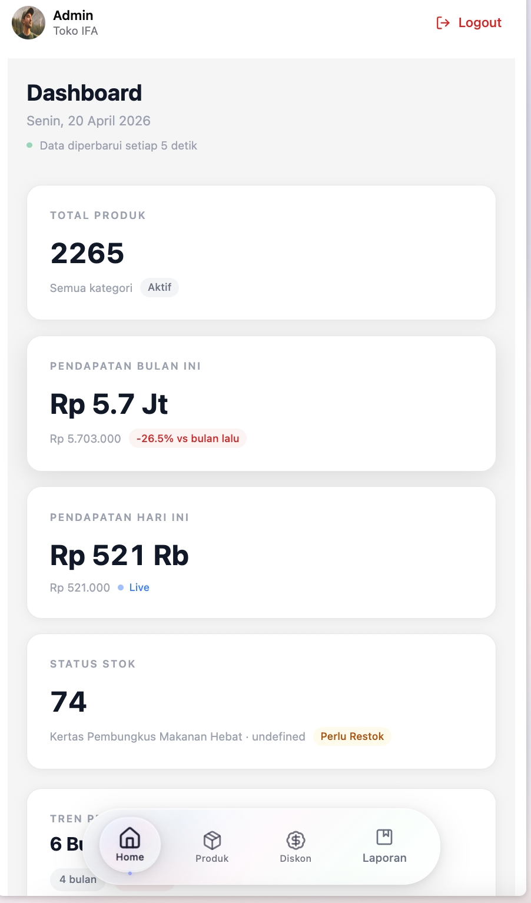
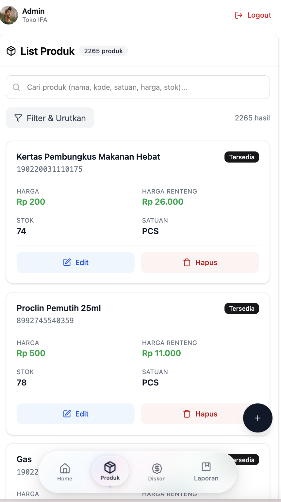
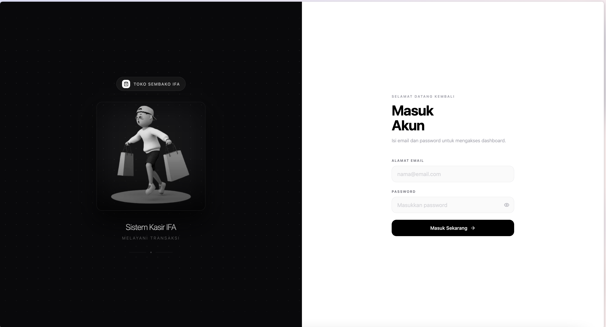
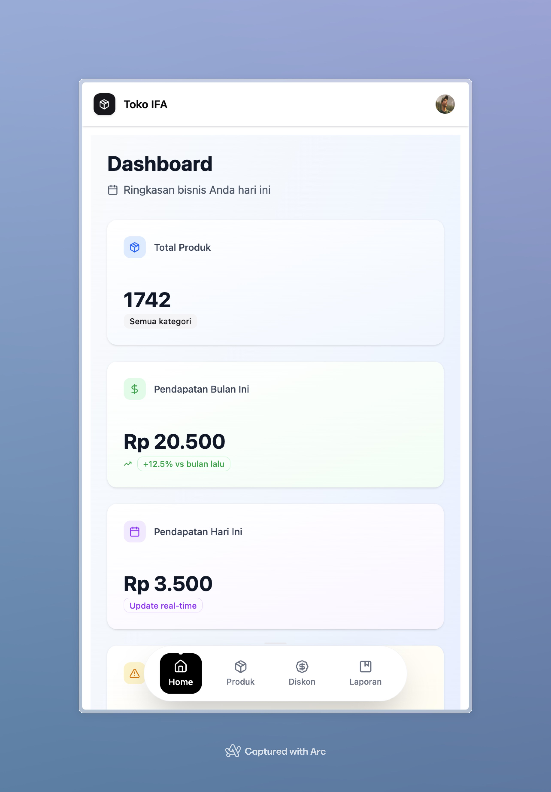

# Sistem Kasir POS (Point of Sale) 🛒💻



## 📋 Tentang Proyek

Sistem Kasir Point of Sale (POS) modern yang dirancang untuk toko retail dengan fitur lengkap untuk manajemen transaksi, inventori, dan laporan keuangan. Dibangun dengan React dan teknologi web terbaru untuk performa optimal dan pengalaman pengguna yang intuitif.

## ✨ Fitur Utama

### 🛒 Transaksi Kasir
- Scan barcode otomatis dengan dukungan berbagai jenis scanner.
- Input manual produk dengan pencarian real-time.
- Multi-satuan (pcs, pack, dozen, dll) dengan konversi harga otomatis.
- Sistem diskon fleksibel (persentase, nominal, promo khusus).
- Perhitungan kembalian real-time.

### 📊 Manajemen Produk
- Database produk dengan kode barcode unik.
- Stok otomatis berkurang saat transaksi.
- Kategori dan sub-kategori produk.
- Harga jual berbeda berdasarkan satuan.
- Promo dan diskon spesial.

### 📈 Laporan & Analisis
- Laporan penjualan harian.
- Riwayat transaksi per user.

### 🔐 Keamanan
- Login dengan autentikasi secure.
- Batasan akses berdasarkan role.

## 🖼️ Screenshots Aplikasi

| Dashboard Kasir Utama | Manajemen Produk |
|:---------------------:|:----------------:|
|  |  |
| *Tampilan utama kasir dengan keranjang belanja* | *Interface pengelolaan katalog produk* |

| Login UI | Mobile Responsive |
|:--------:|:-----------------:|
|  |  |
| *Halaman Login Autentikasi* | *Tampilan optimal untuk mobile* |

## 🛠️ Teknologi yang Digunakan

| Teknologi | Kegunaan |
|-----------|----------|
| **React 18** | UI Framework utama |
| **Vite** | Build tool ultra cepat |
| **Tailwind CSS** | Styling utility-first |
| **React Router** | Navigasi SPA |
| **Axios** | HTTP client untuk API |
| **SweetAlert2** | Notifikasi modern |
| **React Hook Form** | Form validation |
| **Zustand/Context API** | State management |
| **ESLint + Prettier** | Code quality |

## 🚀 Instalasi & Menjalankan

### Prasyarat
- Node.js 18+ dan npm/yarn
- Database MySQL/PostgreSQL
- Barcode scanner (opsional)

### Langkah Instalasi

1. **Clone repository**
   ```bash
   git clone [repository-url]
   cd kasir-pos
   ```

2. **Install dependencies**
   ```bash
   npm install
   # atau
   yarn install
   ```

3. **Setup environment**
   ```bash
   cp .env.example .env.local
   # Edit file .env.local dengan konfigurasi database Anda
   ```

4. **Jalankan development server**
   ```bash
   npm run dev
   # atau
   yarn dev
   ```

### Build untuk Production
```bash
npm run build
npm run preview
```

## 📁 Struktur Proyek

```text
src/
├── components/     # Komponen React reusable
│   ├── kasir/      # Komponen khusus kasir
│   ├── layout/     # Layout komponen
│   └── ui/         # Komponen UI dasar
├── pages/          # Halaman aplikasi
├── hooks/          # Custom hooks
├── api/            # Konfigurasi API
├── utils/          # Utility functions
├── styles/         # Global styles
└── assets/         # Gambar, font, dll
```

## 🔧 Konfigurasi Barcode Scanner

Sistem mendukung berbagai jenis barcode scanner:
- **USB HID Keyboard Emulation** (Plug & Play)
- **Serial/RS-232 Scanner** (dengan konfigurasi port)
- **Wireless Bluetooth Scanner**

*Setup otomatis - Scanner langsung berfungsi setelah terkoneksi ke USB.*

## 🎯 Target Pengguna

- ✅ Toko Retail (Fashion, Elektronik, Peralatan)
- ✅ Minimarket & Supermarket
- ✅ Toko Kebutuhan Sehari-hari
- ✅ Coffee Shop & Restoran
- ✅ Bisnis UMKM

## 📦 Fitur dalam Pengembangan

- [ ] Integrasi payment gateway (QRIS, E-money)
- [ ] Aplikasi mobile companion
- [ ] Backup data ke cloud
- [ ] Multi-gudang/stok
- [ ] Loyalty program
- [ ] Notifikasi stok menipis

## 👥 Kontribusi

1. Fork repository
2. Buat branch fitur (`git checkout -b fitur-baru`)
3. Commit perubahan (`git commit -m 'Menambah fitur X'`)
4. Push ke branch (`git push origin fitur-baru`)
5. Buat Pull Request

## 📄 Lisensi

Proyek ini menggunakan lisensi MIT. Lihat file [LICENSE](LICENSE) untuk detail.
